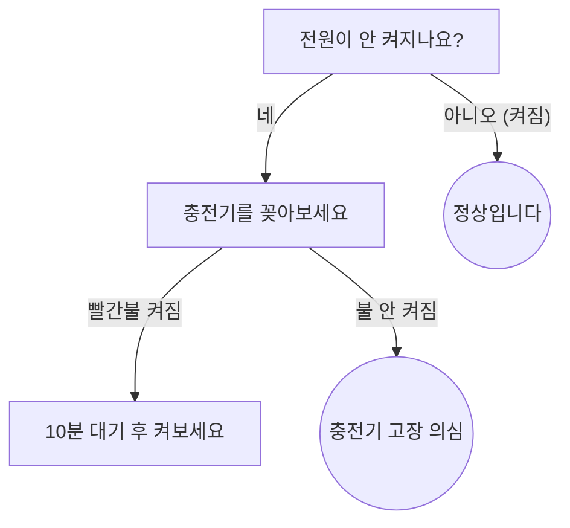

# 📝 마크다운(Markdown) 문서 작성 완벽 가이드

이 문서는 일반 사용자나 관리자가 가이드 매뉴얼을 작성할 때 활용할 수 있는 **마크다운(Markdown) 문법**들을 소개합니다. 이 시스템(GitHub Flavored Markdown)은 텍스트만으로도 멋진 웹페이지 수준의 디자인을 자동으로 적용해 줍니다. 복사해서 바로 사용해 보세요!

---

## 1. 🌈 예쁜 알림 박스 (GitHub Alerts)

중요한 정보나 주의사항을 강조할 때 사용합니다. `>` 기호와 특정 태그를 조합합니다.

```markdown
> [!NOTE]
> **참고사항**
> 꿀팁이나 참고할 만한 부가 정보를 적습니다.

> [!TIP]
> **작업 팁**
> 이렇게 하면 더 빠르게 해결할 수 있어요!

> [!IMPORTANT]
> **중요 사항**
> 놓치면 안 되는 핵심적인 내용을 강조할 때 씁니다.

> [!WARNING]
> **주의 사항**
> 고장이 발생할 수 있으니 조심하세요.

> [!CAUTION]
> **위험/경고**
> 안전과 직결된 매우 치명적인 문제를 경고할 때 씁니다.
```

---

## 2. 🗂️ 접었다 펴기 (아코디언 메뉴)

글이 너무 길어질 때, 상세 설명을 숨겨두고 클릭하면 펼쳐지게 만들 수 있습니다. HTML 태그를 살짝 섞어 씁니다.

```html
<details>
  <summary><b>여기를 눌러서 상세 점검 방법을 확인하세요 (클릭)</b></summary>
  <br>
  짜잔! 숨겨져 있던 내용이 나옵니다. 여기에 사진이나 리스트를 넣어도 잘 작동합니다.
  - 전원 차단
  - 나사 분해
</details>
```

---

## 3. ✅ 체크리스트 (진행률 확인)

점검해야 할 단계나 할 일 목록을 만들 때 유용합니다.

```markdown
- [x] 타이어 공기압 확인 (완료)
- [x] 체인 윤활유 도포 (완료)
- [ ] 브레이크 장력 조절 (진행 전)
- [ ] 배터리 완충 상태 확인 (진행 전)
```

---

## 4. 📊 깔끔한 표 (Tables)

데이터나 부품 스펙, 에러 코드 등을 깔끔하게 표로 정리할 수 있습니다.

```markdown
| 에러 코드 | 증상 요약 | 해결 방법 |
| :--- | :--- | :--- |
| **E01** | 통신 에러 | 컨트롤러 선 연결 상태를 재확인하세요. |
| **E05** | 브레이크 센서 이상 | 브레이크 레버가 꽉 잡혀있는지 확인하세요. |
| **E09** | 컨트롤러 이상 | 고객센터로 연락하여 부품을 교체해야 합니다. |
```

---

## 5. 🧠 흐름도 및 다이어그램 (Mermaid.js)

문서 안에 텍스트만으로 순서도나 다이어그램을 삽입할 수 있습니다!
(※ 주의: 괄호`()` 같은 특수기호를 화살표 라벨에 적을 때는 반드시 쌍따옴표`""`로 감싸주세요!)



---

## 6. 🖼️ 사진 넣기 및 글자 꾸미기

마크다운에서 이미지를 넣거나 글자를 꾸미는 기본 방식입니다.

```markdown
**이 글씨는 굵게(Bold) 나옵니다**
*이 글씨는 기울임꼴(Italic) 입니다*
~~이 글씨는 취소선이 그어집니다~~

[여기 누르면 네이버로 이동합니다](https://naver.com)

**사진 넣는 법:**

```

이제 이 문법들을 조합해서 다채롭고 가독성 높은 최고 수준의 AS 가이드 문서를 완성해 보세요! 🚀
