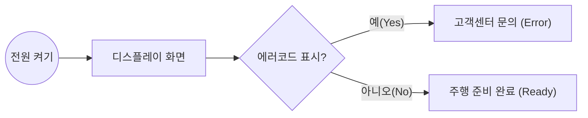
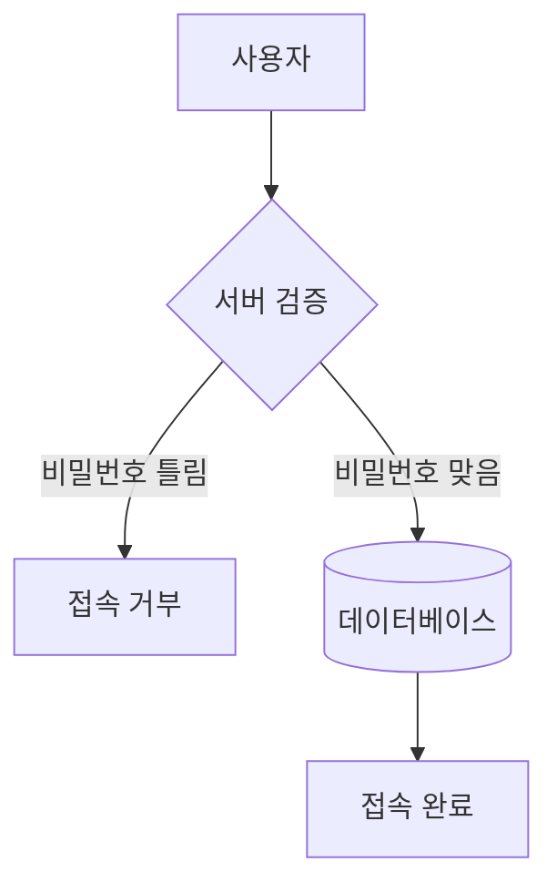
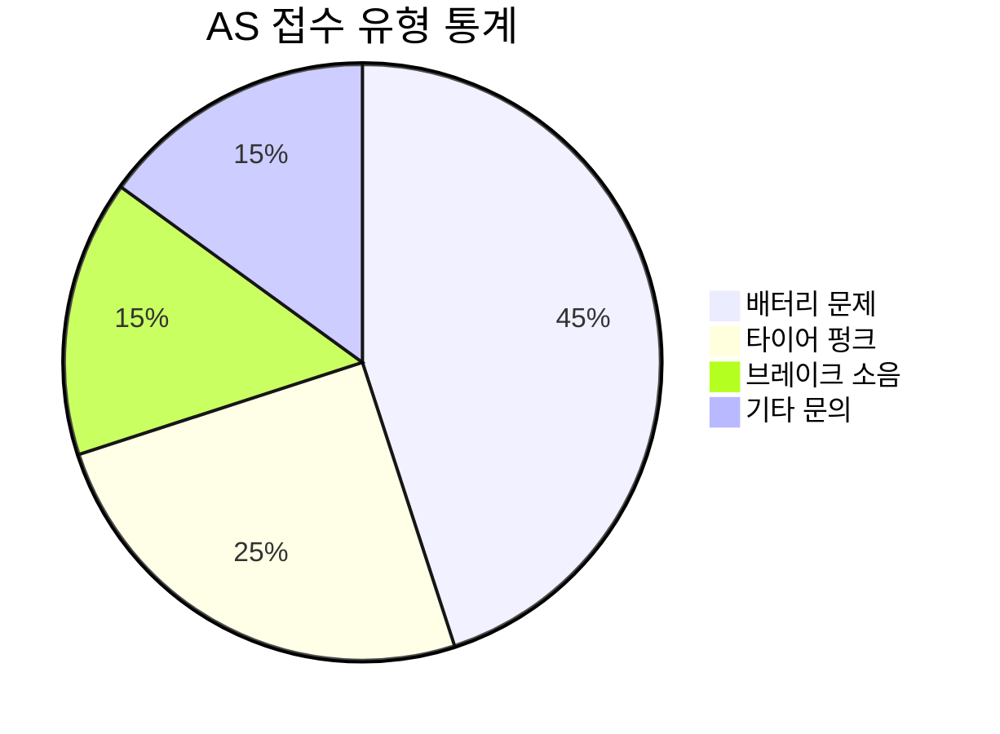
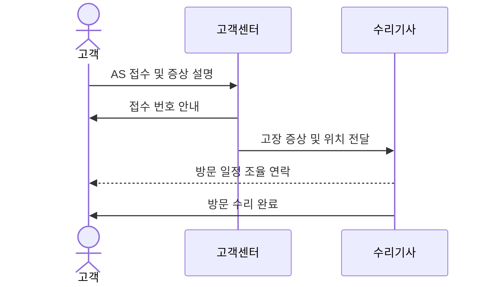
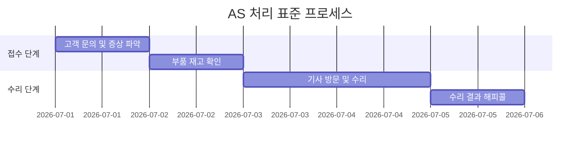

# 관리자용 마크다운 종합 예시 (Admin Guide)

본 문서는 관리자가 깃허브 웹페이지(또는 구글 스프레드시트 연동 페이지)에서 문서 작성 시 활용할 수 있는 모든 마크다운(Markdown) 예시를 담고 있습니다. 해당 문법들은 앱 내에서 시각적으로 변환되어 표시됩니다.

## 1. 깃허브 스타일 알림 박스 (GitHub Alerts)

`> [!키워드]` 형태로 작성하면 예쁜 컬러 알림창으로 변환됩니다. 사용 가능한 키워드 5가지는 아래와 같습니다.

> [!NOTE]
> **참고사항 (Note)**
> 일반적인 안내, 참고 내용이나 부가적인 설명을 적을 때 사용합니다. (파란색 테두리 및 Info 아이콘)

> [!TIP]
> **유용한 팁 (Tip)**
> 알아두면 유용한 꿀팁, 단축키, 추천 방법 등을 안내할 때 사용합니다. (초록색 테두리 및 전구 아이콘)

> [!IMPORTANT]
> **핵심 중요 (Important)**
> 사용자가 반드시 읽고 넘어가야 하는 핵심 정보, 요구사항을 명시할 때 사용합니다. (보라색 테두리)

> [!WARNING]
> **경고 (Warning)**
> 고장, 파손, 작동 불량 등의 문제가 발생할 수 있어 각별한 주의가 필요한 내용을 적을 때 사용합니다. (노란색 테두리 및 주의 아이콘)

> [!CAUTION]
> **위험 (Caution)**
> 신체적 상해, 심각한 안전사고, 혹은 치명적인 문제가 발생할 수 있는 가장 위험한 사항을 경고할 때 사용합니다. (빨간색 테두리 및 방패 아이콘)

---

## 2. 아코디언 메뉴 (접어두기)

매뉴얼에 글이 너무 길어질 때, 부가 설명이나 Q&A 같은 정보는 `
` 태그를 사용하여 접어둘 수 있습니다. 이번 업데이트로 세련된 박스 디자인이 적용되었습니다.

  
<b>여기를 클릭하면 세부 내용이 펼쳐집니다 (Q&A 예시)</b>

   
  
  **Q. 브레이크에서 끽- 하는 소음이 나요.**
  A. 브레이크 패드가 오염되었거나 로터 정렬이 틀어졌을 가능성이 있습니다. 
  가까운 대리점에 방문하여 세척 및 캘리퍼 정렬을 받으시기 바랍니다.
  
  - 리스트 작성도 가능합니다.
  - 마크다운 문법이 그대로 적용됩니다.

---

## 3. Mermaid 다이어그램 (순서도, 흐름도)

웹사이트로 텍스트만 전송하면 엔진이 알아서 그림을 그려주므로, **이미지(사진)를 올리는 것보다 트래픽 사용량이 극단적으로 적고 로딩 속도가 0.1초 미만으로 빠릅니다.** (이미지는 수백 KB이지만, Mermaid는 수십 바이트에 불과합니다.)

기본적으로 `graph TD`(Top-Down)를 쓰면 위에서 아래로(세로형) 그려집니다.
만약 **좌측에서 우측으로(가로형) 그리고 싶다면 `graph LR`(Left-Right)을 사용**하시면 됩니다.

### 가로형 순서도 예시 (`graph LR`)

### 세로형 복잡한 흐름도 예시 (`graph TD`)

### 파이 차트 (원형 그래프) 예시 (`pie`)
통계 비율을 보여줄 때 유용합니다.

### 시퀀스 다이어그램 (순서도 심화형) 예시 (`sequenceDiagram`)
사용자와 시스템 간의 대화나 절차를 시간 순서대로 보여줍니다.

### 간트 차트 (일정표) 예시 (`gantt`)
프로젝트 일정이나 작업 소요 시간을 막대그래프로 보여줍니다.

---

## 4. 테이블 (표) 형식

웹사이트 내에서 표를 깔끔하게 보여주고 싶을 때 사용하는 마크다운 문법입니다. 글씨 정렬(좌측, 중앙, 우측)도 가능합니다.

| 부품명 (좌측 정렬) | 교체 주기 (중앙 정렬) | 예상 비용 (우측 정렬) |
| :--- | :---: | ---: |
| 브레이크 패드 | 3~6개월 | 15,000원 |
| 튜브 (타이어 내부) | 펑크 시 | 12,000원 |
| 체인 | 3,000km | 20,000원 |
| 배터리 팩 | 2~3년 (수명 저하 시) | 350,000원 |
