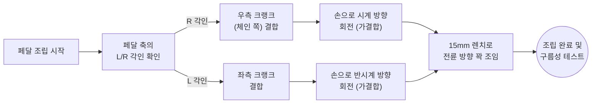

> [!CAUTION]
> **안전 안내 사항**
> - 자전거가 전도되지 않도록 **킥스탠드나 벽면에 안정적으로 거치**하십시오.
> - **전기자전거:** 예기치 않은 모터 작동(PAS 센서 인식) 방지를 위해 반드시 전원을 차단하고 배터리를 분리하십시오.

 

### 🛠️ 1. 필요한 준비물
페달을 안전하고 견고하게 조립하기 위해 아래의 도구를 미리 준비해 주십시오.
- **15mm 렌치** (페달 축 규격에 맞는 전용 렌치 또는 스패너)
- **작업용 장갑** (부상 및 오염 방지)
- **그리스(Grease)** (나사선 도포용, 고착 방지를 위한 권장 사항)

 

### 🔍 2. 좌우 페달 식별
페달 중심축(스핀들)에 각인된 알파벳을 확인하여 좌우를 명확히 분류해야 합니다. 좌우가 바뀌면 결합되지 않으며 나사선이 망가질 수 있습니다.
- **우측 페달(R):** 구동계(체인)가 위치한 방향
- **좌측 페달(L):** 구동계가 없는 방향

 

### 🔧 3. 우측 페달(R) 체결
> [!IMPORTANT]
> 크랭크 나사산의 영구적인 파손 방지를 위해 **반드시 먼저 손으로 가결합**을 진행해 주세요!

우측 페달은 **시계 방향(오른쪽)**으로 회전시켜 결합합니다.

손으로 저항 없이 충분히(3~4회전 이상) 들어갔다면, 마지막에 **15mm 렌치**를 사용하여 전륜 방향(시계 방향)으로 흔들림이 없을 때까지 강하게 조여줍니다.

 

### ⚠️ 4. 좌측 페달(L) 체결 (주의 구간)
> [!WARNING]
> 좌측 페달은 주행 중 풀림을 방지하기 위해 역방향 나사산이 적용되어 있습니다. 방향을 착각하기 쉬우니 각별히 주의하세요!

좌측 페달은 우측과 반대인 **시계 반대 방향(왼쪽)**으로 회전시켜 결합합니다. 마찬가지로 손으로 먼저 부드럽게 돌려 가결합합니다.

손으로 충분히 결합했다면, **15mm 렌치**를 사용하여 전륜 방향(시계 반대 방향)으로 단단히 조여줍니다.

 

### ✅ 5. 안전 경고 및 최종 점검

> [!TIP]
> **💡 공통 조임 팁:** 헷갈리신다면, 양쪽 페달 모두 렌치를 쥔 상태에서 **자전거 앞바퀴(전륜) 방향으로 돌리면 조여진다**고 기억하시면 쉽습니다.

> [!CAUTION]
> **유격 및 체결 불량 경고**
> 불완전한 체결은 주행 중 크랭크 파손 및 페달 이탈을 유발하여 심각한 부상이나 사고로 이어질 수 있습니다. **반드시 유격이 없도록 렌치로 체중을 실어 견고히 조이십시오.**

**최종 구름성 점검:** 조립이 끝난 후 페달을 역방향으로 헛돌려 보았을 때, 구름성에 이상이 없고 쇳소리나 마찰음이 발생하지 않는지 확인하십시오.

 

### 🚑 추가 정보 및 문제 해결

**크랭크 나사선이 이미 망가져서 헛도는 경우 대처법**
페달을 무리하게 역방향이나 비스듬하게 힘으로 억지로 조이다가 크랭크 암의 나사선(야마)이 뭉개졌다면 페달이 헛돌거나 주행 중 빠질 수 있습니다.

* **해결책 1:** 손상이 심하지 않다면 가까운 자전거 샵에 방문하여 **탭핑(Tapping) 공구**를 이용해 나사선을 복원할 수 있습니다.
* **해결책 2:** 손상이 심각하다면 **크랭크 암 전체를 새 부품으로 교체**해야 합니다. (아래 고객센터로 부품 주문)

  <a href="https://pf.kakao.com/_xhxhRZxl" target="_blank" class="md-btn md-btn-kakao">
    💬카카오톡 상담
  </a>
  <a href="https://qualisports.kr/board/free/agency_list_with_map.html" target="_blank" class="md-btn md-btn-dealer">
    📍전국 대리점
  </a>

 

### 📊 페달 조립 표준 순서도 (Mermaid)

