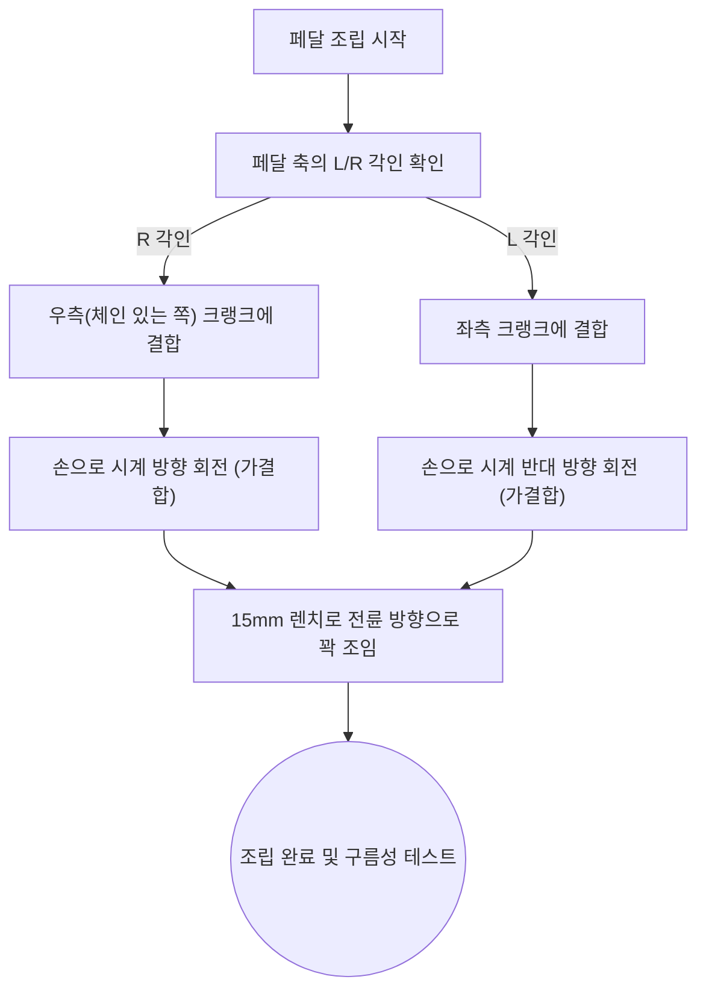

> [!CAUTION]
> **안전 안내 사항**
> - 자전거가 전도되지 않도록 **킥스탠드나 벽면에 안정적으로 거치**하십시오.
> - **전기자전거:** 예기치 않은 모터 작동(PAS 센서 인식) 방지를 위해 반드시 전원을 차단하고 배터리를 분리하십시오.

---

#### 1. 필요한 준비물
페달을 안전하고 견고하게 조립하기 위해 사전 준비 도구를 마련해 주십시오.
- **15mm 렌치** (페달 축 규격에 맞게 사용)
- 작업용 장갑 (손 보호용)
- 그리스(Grease) (나사선 도포용, 권장 사항)

---

#### 2. 좌우 페달 식별
페달 중심축(스핀들)에 각인된 알파벳을 확인하여 좌우를 명확히 분류하십시오.
- **우측 페달(R):** 구동계(체인)가 위치한 방향
- **좌측 페달(L):** 구동계가 없는 방향

---

#### 3. 우측 페달(R) 체결
크랭크 나사산의 영구적인 파손 방지를 위해 먼저 손으로 가결합을 진행합니다.
우측은 **시계 방향 회전**으로 결합됩니다.

손으로 충분히 결합했다면, **15mm 렌치**를 사용하여 전륜 방향(시계 방향)으로 강하게 조입니다.

---

#### 4. 좌측 페달(L) 체결 (많이 실수하는 곳!)
풀림 방지를 위해 **역방향 나사산**이 적용되어 있습니다. 크랭크 스레드의 손상 방지를 위해 먼저 손으로 **시계 반대 방향 회전**하여 결합하십시오.

손으로 충분히 결합했다면, **15mm 렌치**를 사용하여 전륜 방향(시계 반대 방향)으로 강하게 조입니다.

---

#### 5. 안전 경고 및 최종 점검

> **💡 공통 지침:** 양쪽 페달 모두 **자전거 전륜(앞바퀴) 방향**으로 돌리면 결합됩니다. 저항 없이 3~4회전 이상 부드럽게 손으로 결합된 후 공구를 사용하는 것이 정상입니다.

> [!WARNING]
> **유격 및 체결 불량 경고**
> 불완전한 체결은 주행 중 크랭크 파손 및 페달 이탈을 유발하여 심각한 사고로 이어질 수 있습니다. **반드시 유격이 없도록 견고히 조이십시오.**

**최종 구름성 점검:** 페달을 역방향으로 회전시켜 구름성에 이상이 없고 마찰음이 발생하지 않는지 확인하십시오.

---

### 🔍 추가 정보 및 문제 해결 (고급 마크다운 적용 예시)

  
<b>🛠️ 크랭크 나사선이 이미 망가져서 헛도는 경우 대처법 (클릭하여 펴기)</b>

   
  페달을 무리하게 역방향이나 비스듬하게 힘으로 억지로 조이다가 크랭크 암의 나사선(야마)이 뭉개졌다면 페달이 헛돌거나 빠질 수 있습니다.
  
  * **해결책 1:** 손상이 심하지 않다면 자전거 샵에서 **탭핑(Tapping) 공구**를 이용해 나사선을 다시 살릴 수 있습니다.
  * **해결책 2:** 손상이 심각하다면 **크랭크 암 전체를 새 부품으로 교체**해야 합니다. (고객센터에 부품 주문)

 

#### 📊 페달 조립 표준 순서도 (Mermaid)

