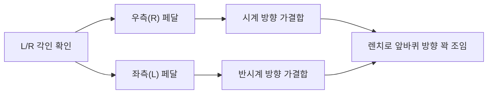

> [!CAUTION]
> **안전 안내 사항**
> - 자전거가 넘어지지 않도록 **안정적으로 거치**하세요.
> - 예기치 않은 모터 작동 방지를 위해 **반드시 전원을 끄고 배터리를 분리**하세요.

 

### 🛠️ 1. 준비물 및 좌우 페달 식별
- **준비물:** 15mm 렌치, 작업용 장갑, 그리스(선택)
- **페달 식별:** 스핀들에 각인된 알파벳(L/R)을 확인하세요. **좌우가 바뀌면 조립이 불가능하고, 나사산이 망가집니다.**
  - **우측(R):** 체인이 **있는** 방향
  - **좌측(L):** 체인이 **없는** 방향

 

### 🔧 2. 페달 장착

> [!IMPORTANT]
> 공구를 쓰기 전 **반드시 손으로 부드럽게 3~4회전 가결합**을 진행해 주세요. (나사선 파손 방지)

#### 👉 우측 페달(R): 시계 방향 회전
우측은 일반 나사선이므로 **시계 방향(오른쪽)** 으로 돌려 결합합니다.

 

#### 👉 좌측 페달(L): 반시계 방향 회전 (주의 구간)
풀림 방지를 위해 역방향 나사산이 적용되어 있습니다. 우측과 반대인 **반시계 방향(왼쪽)** 으로 결합하세요.

 

### ✅ 3. 렌치 고정 및 최종 점검

손 결합이 끝났다면, 15mm 렌치를 사용하여 유격이 없을 때까지 아주 단단히 조여줍니다. 
*(불완전한 체결은 주행 중 페달이 탈락하여 사고를 유발할 수 있습니다)*

> [!TIP]
> **💡 공통 조임 팁:** 양쪽 페달 모두 렌치를 쥔 상태에서 **자전거 앞바퀴(전륜) 방향** 으로 돌리면 꽉 조여집니다.

**마무리:** 페달을 뒤로 헛돌려 뻑뻑함이 없는지 확인하세요.

 

### 🚑 크랭크 나사선 훼손 시
조립 실수로 나사선(야마)이 훼손되었다면, 주행중 페달이 탈락할 수 있음으로 즉시 라이딩을 중단하고 가까운 서비스 센터를 방문하세요.

  <a href="http://pf.kakao.com/_xhxhRZxl/chat" target="_blank" class="md-btn md-btn-kakao">
    
      <svg xmlns="http://www.w3.org/2000/svg" width="18" height="18" viewBox="0 0 24 24" fill="none" stroke="#eab308" stroke-width="2" stroke-linecap="round" stroke-linejoin="round"><path d="M7.9 20A9 9 0 1 0 4 16.1L2 22Z"/></svg>
    
    카카오톡 상담
  </a>
  <a href="https://qualisports.kr/board/free/agency_list_with_map.html" target="_blank" class="md-btn md-btn-dealer">
    
      <svg xmlns="http://www.w3.org/2000/svg" width="18" height="18" viewBox="0 0 24 24" fill="none" stroke="var(--ci-primary)" stroke-width="2" stroke-linecap="round" stroke-linejoin="round"><path d="M20 10c0 6-8 12-8 12s-8-6-8-12a8 8 0 0 1 16 0Z"/><circle cx="12" cy="10" r="3"/></svg>
    
    전국 대리점 위치
  </a>

 

### 📊 페달 조립 한눈에 보기

